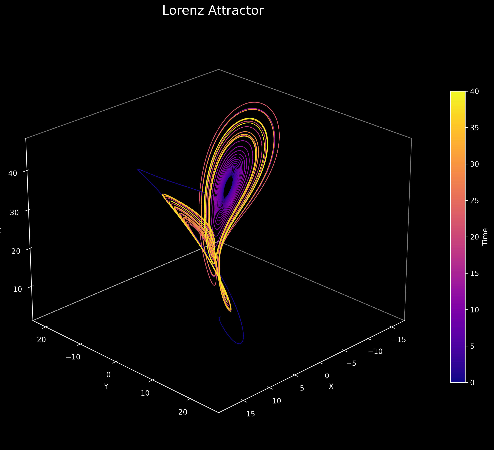

# 🦋 Chaos Theory Visualization Lab

**LA_project** — an interactive, mathematically rigorous exploration of two canonical chaotic systems: the **Logistic Map** (discrete-time) and the **Lorenz System** (continuous-time). Built with Python, visualised via Streamlit, and styled for publication-quality output.

> *"Simple deterministic equations can produce incredibly complex, unpredictable behaviour."*

---

## Table of Contents

- [Overview](#overview)
- [Mathematical Foundations](#mathematical-foundations)
  - [The Logistic Map](#1-the-logistic-map)
  - [The Lorenz System](#2-the-lorenz-system)
  - [Key Quantities Across Both Systems](#3-key-quantities-across-both-systems)
- [Project Structure](#project-structure)
- [Installation](#installation)
- [Usage](#usage)
  - [Streamlit Dashboard](#streamlit-dashboard)
  - [CLI Demos](#cli-demos)
  - [Programmatic API](#programmatic-api)
- [Module Reference](#module-reference)
  - [`logistic/` Package](#logistic-package)
  - [`lorenz/` Package](#lorenz-package)
  - [`common_styles.py`](#common_stylespy)
  - [`dashboard.py`](#dashboardpy)
  - [`main.py`](#mainpy)
- [Visualisation Gallery](#visualisation-gallery)
- [References](#references)
- [Dependencies](#dependencies)

---

## Overview

Chaos theory studies dynamical systems that are **deterministic** (no randomness in their equations) yet exhibit **unpredictable**, **aperiodic** behaviour. This project provides an interactive laboratory for exploring two foundational models:

| System | Type | Equations | Key Phenomena |
|--------|------|-----------|---------------|
| **Logistic Map** | Discrete-time (recurrence) | $x_{n+1} = r \\, x_n \\, (1 - x_n)$ | Period-doubling route to chaos, Feigenbaum universality, Lyapunov exponent |
| **Lorenz System** | Continuous-time (ODEs) | $\dot{x} = \sigma(y - x),\; \dot{y} = x(\rho - z) - y,\; \dot{z} = xy - \beta z$ | Strange attractor, butterfly effect, sensitivity to initial conditions |

Every numerical parameter is exposed through interactive sliders, letting you tune the system in real time and watch how the behaviour changes — from stable fixed points through periodic cycles to fully developed chaos.

---

## Mathematical Foundations

### 1. The Logistic Map

#### Definition

The logistic map is the recurrence relation

$$
x_{n+1} = f(x_n) = r \\, x_n \\, (1 - x_n), \qquad x_n \in [0, 1],\; r \in [0, 4],
$$

where $x_n$ represents a normalised population at generation $n$ and $r$ is the **growth rate parameter**. Despite its algebraic simplicity, this map exhibits an extraordinarily rich range of dynamical regimes.

#### Fixed Points

Fixed points satisfy $x^* = f(x^*)$:

$$
x^* = r x^* (1 - x^*) \quad\Longrightarrow\quad
x_0^* = 0, \qquad x_1^* = 1 - \frac{1}{r}.
$$

- **$x_0^* = 0$** exists for all $r$; it is stable for $0 \le r < 1$ (extinction) and unstable for $r > 1$.
- **$x_1^* = 1 - 1/r$** appears at $r = 1$ via a **transcritical bifurcation**; it is stable for $1 < r < 3$ and unstable for $r > 3$.

#### Linear Stability

The **multiplier** (derivative) at a fixed point determines its stability:

$$
f'(x) = r \\, (1 - 2x), \qquad
|f'(x^*)| < 1 \;\text{(stable)},\quad
|f'(x^*)| > 1 \;\text{(unstable)}.
$$

At $r = 3$, $|f'(x_1^*)| = |2 - r| = 1$, marking the **first period-doubling bifurcation**.

#### Period-Doubling Route to Chaos

As $r$ increases past 3, the system undergoes an infinite cascade of period-doubling bifurcations:

| $r$ value | Regime | Behaviour |
|-----------|--------|-----------|
| $0 \le r < 1$ | Extinction | $x_n \to 0$ |
| $1 \le r < 3$ | Stable fixed point | $x_n \to 1 - 1/r$ |
| $3 \le r \lesssim 3.44949$ | Period-2 cycle | Alternates between two values |
| $3.44949 \le r \lesssim 3.54409$ | Period-4 cycle | Four distinct values |
| $\vdots$ | $\vdots$ | Period-$2^k$ cascade |
| $r_\infty \approx 3.5699456$ | **Chaos onset** | Accumulation point of the cascade |
| $r_\infty < r \le 4$ | Chaotic (with periodic windows) | Aperiodic orbits, interrupted by stable periodic windows (e.g. period-3 at $r \approx 3.82843$) |

#### Feigenbaum Universality

The period-doubling bifurcations converge geometrically with a universal ratio:

$$
\delta = \lim_{k\to\infty} \frac{r_k - r_{k-1}}{r_{k+1} - r_k} \approx 4.669201609\ldots,
$$

where $r_k$ is the parameter value at which the $k$-th period-doubling occurs. The **Feigenbaum constant** $\delta$ is universal across an entire class of unimodal maps, not just the logistic map.

The **accumulation point** $r_\infty$ (the limit of the cascade) is approximately $3.569945671870944$.

#### Lyapunov Exponent

The Lyapunov exponent $\lambda(r)$ quantifies the average exponential rate at which nearby trajectories diverge:

$$
\lambda(r) = \lim_{N\to\infty} \frac{1}{N} \sum_{n=1}^{N} \ln\bigl| f'(x_n) \bigr|
           = \lim_{N\to\infty} \frac{1}{N} \sum_{n=1}^{N} \ln\bigl| r \\, (1 - 2x_n) \bigr|.
$$

- **$\lambda < 0$** — trajectories converge (stable periodic orbit).
- **$\lambda = 0$** — bifurcation point (neutral stability).
- **$\lambda > 0$** — trajectories diverge exponentially (**chaos**).

The sign of $\lambda$ provides a rigorous, quantitative definition of chaos: a system is chaotic on a bounded attractor precisely when its largest Lyapunov exponent is positive.

#### Superstable Orbits

A **superstable** orbit satisfies $f'(x^*) = 0$, meaning the derivative vanishes. For the period-$2^n$ superstable orbits, the parameter values converge to $r_\infty$ at the Feigenbaum rate:

$$
r_n \approx r_\infty - \frac{C}{\delta^{\,n}}.
$$

Known superstable $r$ values (Strogatz, Table 10.1):

| $n$ | Period | $r_n$ |
|-----|--------|-------|
| 1 | 2 | 3.0 |
| 2 | 4 | 3.44949 |
| 3 | 8 | 3.54409 |
| 4 | 16 | 3.56441 |
| 5 | 32 | 3.56876 |
| 6 | 64 | 3.56969 |
| 7 | 128 | 3.56989 |
| $\infty$ | Chaos | 3.5699456 |

---

### 2. The Lorenz System

#### Governing Equations

The Lorenz system is a set of three coupled, first-order ordinary differential equations (Lorenz, 1963):

$$
\begin{aligned}
\dot{x} &= \sigma \\, (y - x),\\
\dot{y} &= x \\, (\rho - z) - y,\\
\dot{z} &= x y - \beta z,
\end{aligned}
$$

where $\sigma$, $\rho$, $\beta > 0$ are parameters with physical interpretations:

| Parameter | Name | Classical Value | Physical Meaning |
|-----------|------|-----------------|------------------|
| $\sigma$ | Prandtl number | 10 | Ratio of viscous diffusivity to thermal diffusivity |
| $\rho$ | Rayleigh number | 28 | Temperature difference driving convection (normalised) |
| $\beta$ | Aspect ratio | $8/3 \approx 2.667$ | Geometric factor related to the spatial domain |

The system was originally derived as a highly simplified model of Rayleigh–Bénard convection — a fluid layer heated from below.

#### Fixed Points

For $\rho > 1$, the system has three fixed points:

**The origin (conduction state):**

$$
C_0 = (0, 0, 0),
$$

which is unstable for $\rho > 1$.

**The convective fixed points (the "butterfly eyes"):**

$$
C_{\pm} = \bigl(\pm\sqrt{\beta(\rho - 1)},\; \pm\sqrt{\beta(\rho - 1)},\; \rho - 1\bigr).
$$

For the classical parameters ($\sigma = 10$, $\rho = 28$, $\beta = 8/3$):

$$
C_{\pm} \approx (\pm 6\sqrt{2},\; \pm 6\sqrt{2},\; 27) \approx (\pm 8.4853,\; \pm 8.4853,\; 27).
$$

At the classical parameter values, $C_+$ and $C_-$ are both **unstable** — trajectories spiral around them aperiodically, creating the butterfly-shaped strange attractor.

#### The Lorenz Attractor

The Lorenz attractor is the **strange attractor** that emerges from the system for $\sigma = 10$, $\rho = 28$, $\beta = 8/3$. Key properties:

- **Fractal structure**: the attractor has zero volume but infinite surface area — its Hausdorff dimension is approximately 2.06.
- **Aperiodic orbits**: the trajectory never repeats and never intersects itself.
- **Lobe switching**: the system spirals around $C_+$ for an unpredictable number of revolutions, then switches to $C_-$, then back — the switching sequence is deterministic but chaotic.
- **Dissipative**: phase-space volumes contract exponentially (the divergence of the vector field is $-(1 + \sigma + \beta) < 0$).

#### The Butterfly Effect (Sensitivity to Initial Conditions)

The butterfly effect is the hallmark of deterministic chaos. For the Lorenz system:

$$
\delta(t) \sim \delta_0 \\, e^{\lambda t},
$$

where $\delta(t)$ is the Euclidean distance between two trajectories that started with an infinitesimal separation $\delta_0$, and $\lambda$ is the largest Lyapunov exponent (approximately 0.9 for the classical parameters).

The divergence proceeds through three phases:

1. **Exponential growth** ($\delta_0 \to \delta_0 e^{\lambda t}$): nearby trajectories separate at an exponential rate.
2. **Saturation**: once the distance reaches the size of the attractor, it cannot grow further — trajectories are as far apart as two arbitrary points on the attractor.
3. **Loss of predictability**: because the initial condition can never be known exactly, and the error grows exponentially, long-term prediction becomes impossible beyond a horizon $t_h \sim (1/\lambda) \ln(\delta_\text{max} / \delta_0)$.

> "Does the flap of a butterfly's wings in Brazil set off a tornado in Texas?" — Edward Lorenz, 1972

---

### 3. Key Quantities Across Both Systems

| Quantity | Logistic Map | Lorenz System | Meaning |
|----------|-------------|---------------|---------|
| Control parameter | $r \in [0, 4]$ | $\sigma, \rho, \beta$ | Tunes the dynamical regime |
| Fixed points | $x^* = 0, 1 - 1/r$ | $C_0, C_+, C_-$ | Equilibrium states |
| Stability criterion | $|f'(x^*)| < 1$ | Eigenvalue real parts $< 0$ | Determines if perturbations decay or grow |
| Lyapunov exponent $\lambda$ | $\frac{1}{N}\sum \ln|r(1-2x_n)|$ | Max eigenvalue of variational ODE | $\lambda > 0$ = chaos |
| Bifurcation sequence | Period-doubling cascade | Hopf → homoclinic → chaos | Route from order to chaos |
| Critical values | $r = 3, 3.45, 3.57, 3.83$ | $\rho \approx 24.74$ (Hopf) | Transition points |

---

## Project Structure

```
LA_project/
│
├── README.md                  ← This file
├── requirements.txt           ← Python dependencies
├── main.py                    ← Entry point (currently empty / placeholder)
├── dashboard.py               ← Streamlit interactive web application
├── common_styles.py           ← Shared theming, LaTeX annotations, colour palettes
│
├── logistic/                  ← Logistic Map analysis package
│   ├── __init__.py
│   ├── logistic_map.py        ← Core recurrence, orbit generation, fixed-point analysis
│   ├── bifurcation.py         ← Bifurcation diagram (period-doubling route to chaos)
│   ├── lyapunov.py            ← Lyapunov exponent spectrum λ(r)
│   └── time_series.py         ← Iteration-by-iteration time series panels
│
├── lorenz/                    ← Lorenz System analysis package
│   ├── __init__.py
│   ├── lorenz_solver.py       ← Numerical integration (solve_ivp), fixed-point computation
│   ├── lorenz_3d_plot.py      ← 3D rendering of the Lorenz strange attractor
│   └── sensitivity_plot.py    ← Butterfly Effect — divergence of nearby trajectories
│
└── docs/
    └── report.md              ← Supplementary project report
```

---

## Installation

### Prerequisites

- Python 3.10 or later
- pip

### Setup

```bash
# Clone the repository
git clone <repo-url> LA_project
cd LA_project

# Create a virtual environment (recommended)
python -m venv venv
source venv/bin/activate   # On Windows: venv\Scripts\activate

# Install dependencies
pip install -r requirements.txt
```

**Dependencies:**

| Package | Purpose |
|---------|---------|
| `numpy` | Numerical arrays, vectorised operations |
| `scipy` | ODE integration (`solve_ivp`) |
| `matplotlib` | All plotting and visualisation |
| `plotly` | Supplementary interactive plots |
| `pandas` | Data management and export |
| `streamlit` | Interactive web dashboard |

---

## Usage

### Streamlit Dashboard

The primary interface is an interactive web application:

```bash
streamlit run dashboard.py
```

Then open the URL printed to the terminal (typically `http://localhost:8501`).

The sidebar offers five visualisation pages:

| Page | Description | Key Controls |
|------|-------------|--------------|
| **Lorenz Attractor** | 3D trajectory of the Lorenz system | $\sigma, \rho, \beta$, $t_\text{max}$, camera angle, colormap, initial conditions |
| **Butterfly Effect** | Log-scale divergence of nearby trajectories | Perturbation magnitude $\delta_0$, perturbed coordinate, exponential fit toggle |
| **Logistic Time Series** | $x_n$ vs $n$ for canonical $r$ values | Mode: 4-panel overview or single custom $r$, transient length |
| **Bifurcation Diagram** | Full period-doubling cascade | $r$ range, resolution, density colouring, transition annotations |
| **Lyapunov Exponent** | $\lambda(r)$ spectrum | $r$ range, sample count, transient length, chaotic/stable fills |

### CLI Demos

Every module can be run directly from the command line for quick visualisation:

```bash
# Logistic Map
python -m logistic.logistic_map          # Print an orbit and fixed points
python -m logistic.bifurcation           # Generate bifurcation_diagram.png
python -m logistic.lyapunov              # Generate lyapunov_exponent.png
python -m logistic.time_series           # Generate logistic_time_series.png

# Lorenz System
python -m lorenz.lorenz_solver           # Print trajectory summary and fixed points
python -m lorenz.lorenz_3d_plot          # Generate lorenz_attractor.png
python -m lorenz.sensitivity_plot        # Generate butterfly_effect.png
```

### Programmatic API

All functions are importable and fully documented:

```python
import numpy as np
import matplotlib.pyplot as plt

# --- Logistic Map ---
from logistic.logistic_map import logistic, generate_orbit, fixed_points, lyapunov_exponent
from logistic.bifurcation import plot_bifurcation
from logistic.lyapunov import plot_lyapunov
from logistic.time_series import plot_time_series, plot_single_time_series

# Generate an orbit with 2000-iteration burn-in
orbit = generate_orbit(r=3.9, x0=0.5, iterations=100, transient=2000)

# Compute Lyapunov exponent
lam = lyapunov_exponent(r=3.9, transient=1000, iterations=2000)  # ≈ 0.5

# Plot a bifurcation diagram (returns matplotlib Figure)
fig = plot_bifurcation(r_min=2.4, r_max=4.0, num_r=5000)

# --- Lorenz System ---
from lorenz.lorenz_solver import solve_lorenz, lorenz_fixed_points, lorenz_deriv
from lorenz.lorenz_3d_plot import plot_lorenz
from lorenz.sensitivity_plot import plot_sensitivity

# Solve the Lorenz system
t, x, y, z = solve_lorenz(
    initial_conditions=(0.0, 1.0, 1.05),
    t_end=40.0,
    num_points=10000,
    sigma=10.0, rho=28.0, beta=8/3,
)

# Compute fixed points
fps = lorenz_fixed_points(sigma=10, rho=28, beta=8/3)
# Returns: ((0, 0, 0), (8.49, 8.49, 27), (-8.49, -8.49, 27))

# Plot the attractor
fig = plot_lorenz(
    elevation=25, azimuth=45,
    colormap="plasma",
    show_fixed_points=True,
)

# Plot butterfly effect
fig = plot_sensitivity(
    perturbation=1e-5, axis=2,  # perturb z-coordinate by 1e-5
)
```

---

## Module Reference

### `logistic/` Package

#### `logistic_map.py` — Core Kernel

**Functions:**

- **`logistic(r, x)`** — Single iteration $x_{n+1} = r \cdot x_n \cdot (1 - x_n)$. Vectorised: accepts both scalars and `ndarray`.
- **`generate_orbit(r, x0, iterations, transient, return_burnin)`** — Generate a sequence of iterates. Allocates separate arrays for burn-in (transient) and recording phases. Uses explicit Python iteration (not vectorised) because each step depends on the previous — the map is inherently sequential.
- **`fixed_points(r)`** — Analytical fixed points $x_0^* = 0$, $x_1^* = 1 - 1/r$.
- **`fixed_point_stability(r, x_star)`** — Returns `"stable"`, `"unstable"`, or `"neutral"` based on $|f'(x^*)|$.
- **`superstable_r(n)`** — Returns the $n$-th superstable parameter value. Uses known values from Strogatz Table 10.1 for $n \le 7$; extrapolates via the Feigenbaum constant $\delta$ for $n > 7$.

**CLI:** `python -m logistic.logistic_map` prints an orbit and fixed-point analysis.

#### `bifurcation.py` — Bifurcation Diagram

The bifurcation diagram reveals the **asymptotic attractor** as a function of $r$. For each $r$ value, the map is iterated `transient` times to eliminate initial-condition effects, then `keep` values are recorded and plotted against $r$.

**Key functions:**

- **`generate_bifurcation_data(r_min, r_max, num_r, transient, keep, x0, randomize_x0)`** — Generates $(r, x)$ scatter data. When `randomize_x0=True` (default), a fresh random initial condition is used per $r$, revealing the full attractor structure even when multiple attractors coexist. Memory usage: $\text{num}_r \times \text{keep} \times 16$ bytes (~80 MB at default settings).
- **`plot_bifurcation(...)`** — Renders the diagram. Two colouring modes:
  - **Density colouring** (default): builds a $2000 \times 1000$ 2D histogram and applies $\log_{10}(count+1)$ colour scaling, highlighting the attractor's fine structure.
  - **Uniform scatter**: faster but less detailed.
  - **Annotations**: critical lines at $r = 3$ (period-2), $r \approx 3.45$ (period-4), $r_\infty \approx 3.57$ (chaos onset), $r \approx 3.83$ (period-3 window).

#### `lyapunov.py` — Lyapunov Exponent Spectrum

Computes the Lyapunov exponent $\lambda(r)$ across a range of $r$ values, providing a rigorous separation of stable and chaotic regimes.

**Key functions:**

- **`lyapunov_exponent(r, x0, transient, iterations)`** — Computes $\lambda$ for a single $r$. The sum $\sum \ln|r(1-2x_n)|$ is clipped at $\ln(10^{-10})$ to prevent singularities when $x_n = 0.5$.
- **`generate_lyapunov_data(r_min, r_max, num_r, transient, iterations, x0)`** — Sweeps $\lambda(r)$ across $r$.
- **`plot_lyapunov(...)`** — Plots $\lambda(r)$ with:
  - **Red fill** ($\lambda > 0$): chaotic regimes.
  - **Green fill** ($\lambda < 0$): stable periodic regimes.
  - Dashed zero line at $\lambda = 0$.
  - Critical transition lines.
  - Info box showing the chaotic fraction and maximum $\lambda$.

#### `time_series.py` — Time Series Panels

Plots $x_n$ vs iteration number $n$ for selected $r$ values, showing the transition from fixed-point convergence to aperiodic behaviour.

**Two display modes:**

1. **4-panel overview**: shows the four canonical $r$ values (2.8, 3.2, 3.5, 3.9) side-by-side with regime labels and colour-coded curves.
2. **Single custom $r$**: detailed view with adjustable transient length, fixed-point overlay, and parameter info box.

The same initial condition $x_0 = 0.5$ is used across all panels — only $r$ changes, highlighting that the parameter alone determines the asymptotic regime.

**Key functions:**

- **`plot_time_series(r_values, x0, iterations, ...)`** — Multi-panel figure.
- **`plot_single_time_series(r, x0, iterations, transient, ...)`** — Single detailed panel.

---

### `lorenz/` Package

#### `lorenz_solver.py` — Numerical Integration

**Functions:**

- **`lorenz_deriv(t, coords, sigma, rho, beta)`** — Right-hand side of the Lorenz ODEs. The signature follows `scipy.integrate.solve_ivp` conventions: `t` is accepted but unused (the system is autonomous).
- **`lorenz_fixed_points(sigma, rho, beta)`** — Analytical fixed points. For $\rho < 1$, only the origin exists. For $\rho > 1$, all three fixed points $(C_0, C_+, C_-)$ are returned.
- **`solve_lorenz(initial_conditions, t_start, t_end, num_points, sigma, rho, beta, method, rtol, atol, max_step)`** — Wraps `scipy.integrate.solve_ivp` with the `RK45` method (4th/5th-order Runge-Kutta with adaptive step-size control). Raises `RuntimeError` if integration fails. Returns evenly spaced time grid and trajectory arrays.

**Numerical considerations:**

- Adaptive step-size control ensures accuracy through the chaotic trajectory while maintaining efficiency.
- Default tolerances ($\text{rtol}=10^{-6}$, $\text{atol}=10^{-9}$) provide ~5-6 significant digits.
- The `DOP853` method (8th order) can be selected for higher precision at the cost of computation time.

#### `lorenz_3d_plot.py` — 3D Attractor

Renders the Lorenz attractor as a colour-mapped 3D trajectory using `mpl_toolkits.mplot3d.art3d.Line3DCollection`.

**Key function:**

- **`plot_lorenz(initial_conditions, t_end, num_points, sigma, rho, beta, elevation, azimuth, colormap, line_width, show_fixed_points, show_equation, show_colorbar, transparent_panes, figsize, dpi)`**

**Visual features:**

- **Colour gradient**: the trajectory is segmented into $\text{num}_\text{points} - 1$ line segments, each coloured by time using a configurable colormap (default: `plasma`, from blue → purple → red). This reveals the temporal flow as the system winds around the attractor.
- **Fixed-point markers**: $C_+$ and $C_-$ are marked with orange circles and labelled $\text{C}_+$, $\text{C}_-$.
- **Transparent panes**: the 3D axes panes are made transparent for a clean, publication-style look, with subtle grid lines at the axes.
- **Equation overlay**: the Lorenz equations are displayed in a rounded bounding box in the top-left corner.
- **Info box**: displays parameter values, time range, point count, and initial conditions in the top-right corner.
- **Camera control**: elevation and azimuth angles are fully adjustable.

#### `sensitivity_plot.py` — Butterfly Effect

Demonstrates the exponential divergence of two nearly identical trajectories.

**Key functions:**

- **`compute_divergence(ic1, perturbation, axis, t_end, num_points, sigma, rho, beta)`** — Solves the Lorenz system for both the reference and perturbed initial conditions, returning both trajectories.
- **`plot_sensitivity(...)`** — Plots the Euclidean distance $\delta(t)$ on a logarithmic scale.

**Visual features:**

- **Main curve**: $\delta(t)$ vs $t$ on a log-linear scale. The initial flat section is numerical noise below machine precision; exponential growth begins once the perturbation reaches a resolvable magnitude.
- **Exponential fit** (optional): a linear fit $\ln \delta = \lambda t + \text{const}$ over the growth phase (default range: $t \in [2, 15]$), using `numpy.polyfit`. The estimated $\lambda$ is displayed in the legend — values near 0.9 for classical parameters.
- **Saturation line** (optional): horizontal dotted line at $\delta_\text{max}$, the approximate span of the attractor.
- **Info box**: shows the perturbation magnitude, the perturbed coordinate, the final distance, and the total expansion factor $\delta_\text{final} / \delta_0$ — often exceeding $10^5$ for $t = 40$.

---

### `common_styles.py`

Shared theming and plotting utilities. Every plotting function calls `apply_dark_theme()` once per session (idempotent), ensuring consistent dark-mathematical styling.

**Configuration applied:**

- Dark background (`#0d1117` — GitHub dark theme)
- Light grid lines (`#21262d`) on a discrete grid
- Left/bottom spines only (no top/right spines)
- DejaVu Sans mathtext font set
- 150 DPI base resolution
- Consistent legend and tick styling

**Helper functions:**

| Function | Purpose |
|----------|---------|
| `apply_dark_theme(font_size, dpi, use_latex)` | Apply global `rcParams` |
| `figure_size(width, aspect)` | Compute (width, height) with golden-ratio aspect |
| `scientific_axis(ax)` | Apply scientific-offset tick formatting |
| `add_equation_box(ax, eq_text, x, y, ...)` | LaTeX equation in rounded bounding box |
| `add_critical_line(ax, x, label, color, ...)` | Vertical transition line with label |
| `add_zero_line(ax, color, linestyle, alpha)` | Horizontal line at $y=0$ |
| `add_info_box(ax, lines, x, y, ...)` | Multi-line stats box (monospace) |

**Colour palettes:**

- `LINE_PALETTE`: 8 visually distinct colours for line plots.
- `LOGISTIC_COLORS`: colour mapping for the four canonical $r$ values (2.8 → blue, 3.2 → gold, 3.5 → orange, 3.9 → red).
- `TRANSITION_COLORS`: standard highlighting for period-doubling, chaos onset, periodic windows, and critical points.

---

### `dashboard.py`

The Streamlit dashboard ties everything together. It provides:

1. **Lorenz Attractor** — Interactive 3D plot with parameter sliders, camera controls, fixed-point toggles, and colormap selection.
2. **Butterfly Effect** — Sensitivity analysis with perturbation magnitude slider, coordinate selector, and fit toggles.
3. **Logistic Time Series** — 4-panel overview or single custom $r$ with transient control.
4. **Bifurcation Diagram** — Full-resolution diagram with density colouring, $r$-range zoom, and transition annotations.
5. **Lyapunov Exponent** — $\lambda(r)$ spectrum with chaotic/stable region fills and critical line annotations.

### `main.py`

Placeholder entry point. Currently empty — reserved for future programmatic entry points or script orchestration.

---

## Visualisation Gallery

### Lorenz Attractor

The butterfly-shaped strange attractor with time-encoded colouring and fixed-point markers at $C_+$ and $C_-$.

### Butterfly Effect
The log-scale divergence of two trajectories with an initial perturbation of $10^{-5}$ in the $z$-coordinate. Shows exponential growth ($\lambda \approx 0.9$) followed by saturation at the attractor span.

### Logistic Map Time Series
A $2 \times 2$ panel grid showing the four canonical regimes: stable fixed point ($r=2.8$), period-2 ($r=3.2$), period-4 ($r=3.5$), and chaos ($r=3.9$).

### Bifurcation Diagram
The iconic branching diagram showing the period-doubling route to chaos over $r \in [2.4, 4.0]$, with density colouring revealing the attractor's fine fractal structure.

### Lyapunov Exponent Spectrum
The $\lambda(r)$ curve over $r \in [2.4, 4.0]$, with red fill for chaotic regimes ($\lambda > 0$), green fill for stable regimes ($\lambda < 0$), and dashed lines at the critical transition points.

---

## References

### Primary Sources

1. **Lorenz, E. N.** (1963). "Deterministic Nonperiodic Flow". *Journal of the Atmospheric Sciences*, 20(2), 130–141. — The original paper introducing the Lorenz system and the first clear demonstration of deterministic chaos in a continuous-time system.

2. **May, R. M.** (1976). "Simple mathematical models with very complicated dynamics". *Nature*, 261, 459–467. — A landmark paper showing that the logistic map, one of the simplest possible nonlinear recurrences, can produce extraordinarily complex dynamics.

3. **Feigenbaum, M. J.** (1978). "Quantitative universality for a class of nonlinear transformations". *Journal of Statistical Physics*, 19(1), 25–52. — Discovery of the Feigenbaum constant $\delta$ and the universality of the period-doubling route to chaos.

4. **Lorenz, E. N.** (1972). "Predictability: Does the flap of a butterfly's wings in Brazil set off a tornado in Texas?". AAAS meeting talk. — The origin of the term "butterfly effect".

### Textbooks and Reviews

5. **Strogatz, S. H.** (2018). *Nonlinear Dynamics and Chaos*, 2nd edition. Westview Press. — The definitive textbook; Chapters 9 (Lorenz system) and 10 (logistic map / one-dimensional maps) are directly referenced throughout this project.

6. **Sparrow, C.** (1982). *The Lorenz Equations: Bifurcations, Chaos, and Strange Attractors*. Springer. — Comprehensive monograph on the Lorenz system's dynamics.

### Numerical Methods

7. **Benettin, G., Galgani, L., Giorgilli, A., & Strelcyn, J.-M.** (1980). "Lyapunov Characteristic Exponents for smooth dynamical systems and for Hamiltonian systems; a method for computing all of them". *Meccanica*, 15, 9–20. — The standard algorithm for computing Lyapunov spectra from numerical trajectories.

8. **Dormand, J. R. & Prince, P. J.** (1980). "A family of embedded Runge-Kutta formulae". *Journal of Computational and Applied Mathematics*, 6(1), 19–26. — The RK5(4) method used by `scipy.integrate.solve_ivp`.

---

## Dependencies

```
numpy
scipy
matplotlib
plotly
pandas
streamlit
```

Install with `pip install -r requirements.txt`.

---

## Author

Chaos Theory Visualization Lab (LA_project).

Built with Python, NumPy, SciPy, Matplotlib, and Streamlit.
